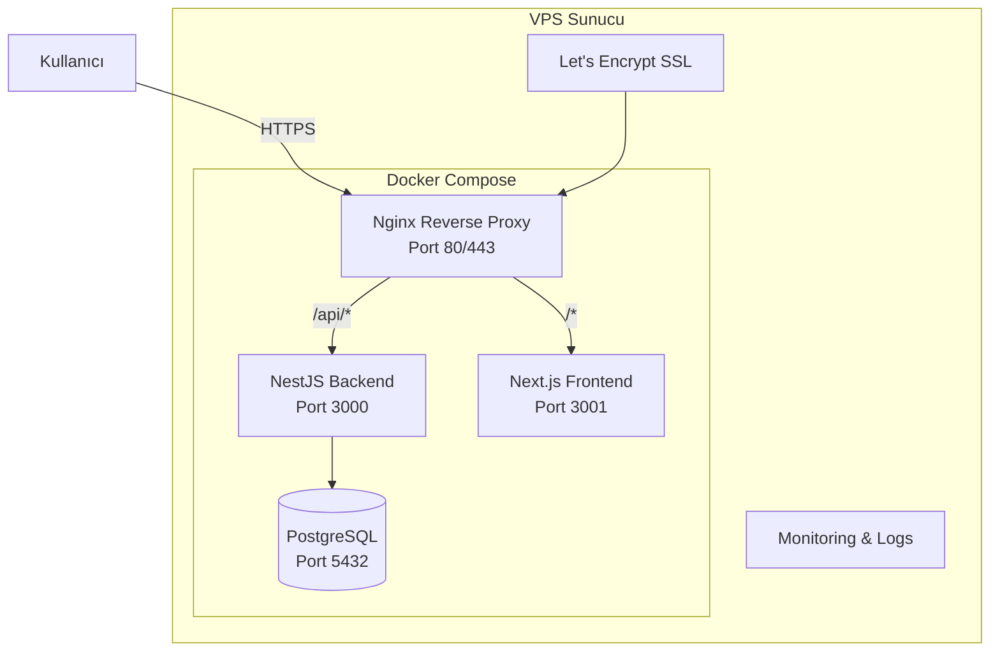

# DG STOK V5.0 - Production Deployment Planı

## Proje Mimarisi (Mikroservis)



## Mevcut Durum Analizi

### 1. Backend (NestJS) - `backend/`
- **Durum**: ✅ Modüller mevcut, `app.module.ts`'te 4 modül aktif (Products, Orders, Auth, Users)
- **Eksikler**: 
  - Diğer modüller (brands, categories, finance, vs.) `app.module.ts`'e eklenmemiş
  - TypeORM migration'ları henüz oluşturulmamış (`synchronize: false`)
  - `.env` değişkenleri backend için ayrıca yapılandırılmamış

### 2. Frontend (Next.js) - `frontend/`
- **Durum**: ✅ Next.js 16, React 19, Tailwind v4 ile yapılandırılmış
- **Eksikler**: next.config.js (veya mjs) dosyası eksik olabilir, standalone output ayarlanmamış

### 3. Docker Yapısı - `docker-compose.yml`
- **Durum**: ✅ Temel yapı mevcut (postgres, backend, frontend, nginx)
- **Eksikler**:
  - SSL/TLS yok (sadece HTTP 80)
  - Healthcheck yok (backend hariç)
  - Redis servisi eklenmemiş (opsiyonel)
  - Environment variable'lar production için güncellenmeli

### 4. Nginx - `nginx.conf`
- **Durum**: ⚠️ Mevcut nginx.conf monolit yapı için (app:4000)
- **Yapılması Gereken**: Mikroservis yapısına göre yeniden yazılmalı

---

## Adım Adım Deployment Planı

### AŞAMA 1: Kod Hazırlıkları

#### 1.1 Backend NestJS Modüllerini Tamamlama
- [`backend/src/app.module.ts`](backend/src/app.module.ts) dosyasına eksik modülleri ekle:
  - BrandsModule, CategoriesModule, FinanceModule
  - InventoryModule, MarketplacesModule, MessagesModule
  - NotificationsModule, ReportsModule, ShipmentsModule
  - SuppliersModule, TemplatesModule, VariantsModule
  - AutomationModule, DiscountsModule, ImportModule
  - HealthModule, SelfHealingModule, AuditLogsModule
- Her modül için entity'lerin TypeORM dekoratörleri ile doğru tanımlandığını kontrol et

#### 1.2 TypeORM Migration Hazırlığı
```bash
cd backend
# Migration oluşturma
npm run migration:generate -- src/database/migrations/InitialSchema
# Migration uygulama
npm run migration:run
```

#### 1.3 Backend Environment (.env)
[`backend/.env`](backend/.env) dosyasını oluştur:
```env
NODE_ENV=production
PORT=3000
DB_HOST=postgres
DB_PORT=5432
DB_USERNAME=postgres
DB_PASSWORD=<güçlü-şifre>
DB_DATABASE=dg_store
DB_SYNCHRONIZE=false
JWT_SECRET=<openssl-rand-64-hex>
JWT_EXPIRES_IN=15m
JWT_REFRESH_SECRET=<openssl-rand-64-hex>
JWT_REFRESH_EXPIRES_IN=7d
FRONTEND_URL=https://<domain>
CORS_ORIGIN=https://<domain>
```

#### 1.4 Frontend Next.js Yapılandırması
[`frontend/next.config.mjs`](frontend/next.config.mjs) (veya .js) dosyasını oluştur:
```mjs
/** @type {import('next').NextConfig} */
const nextConfig = {
  output: 'standalone',
  experimental: {},
};
export default nextConfig;
```

#### 1.5 Frontend Environment
[`frontend/.env`](frontend/.env) dosyasını oluştur:
```env
NEXT_PUBLIC_API_URL=https://<domain>/api
```

---

### AŞAMA 2: Docker & Deployment Yapılandırması

#### 2.1 docker-compose.yml'in Güncellenmesi
[`docker-compose.yml`](docker-compose.yml) dosyasına aşağıdaki iyileştirmeler yapılmalı:

**Değişiklik清单:**
- Backend'e healthcheck ekle
- Redis servisi ekle (opsiyonel, BullMQ için)
- Environment variable'ları `.env` dosyasından çek
- Volume'leri doğru mount et
- Restart politikalarını kontrol et

```yaml
services:
  postgres:
    image: postgres:16-alpine
    container_name: dgstok-postgres
    environment:
      POSTGRES_DB: dg_store
      POSTGRES_USER: postgres
      POSTGRES_PASSWORD: ${DB_PASSWORD}
    ports:
      - "5432:5432"
    volumes:
      - postgres_data:/var/lib/postgresql/data
      - ./backup:/backup
    healthcheck:
      test: ["CMD-SHELL", "pg_isready -U postgres"]
      interval: 5s
      timeout: 5s
      retries: 5
    restart: unless-stopped
    networks:
      - dgstok-network

  backend:
    build:
      context: ./backend
      dockerfile: Dockerfile
    container_name: dgstok-backend
    env_file: ./backend/.env
    environment:
      NODE_ENV: production
      DB_HOST: postgres
    depends_on:
      postgres:
        condition: service_healthy
    healthcheck:
      test: ["CMD", "wget", "--no-verbose", "--tries=1", "--spider", "http://localhost:3000/api/health"]
      interval: 30s
      timeout: 10s
      start_period: 40s
      retries: 3
    restart: unless-stopped
    networks:
      - dgstok-network

  frontend:
    build:
      context: ./frontend
      dockerfile: Dockerfile
      args:
        NEXT_PUBLIC_API_URL: https://${DOMAIN}/api
    container_name: dgstok-frontend
    env_file: ./frontend/.env
    depends_on:
      - backend
    restart: unless-stopped
    networks:
      - dgstok-network

  nginx:
    image: nginx:alpine
    container_name: dgstok-nginx
    ports:
      - "80:80"
      - "443:443"
    volumes:
      - ./nginx.conf:/etc/nginx/nginx.conf:ro
      - ./ssl:/etc/nginx/ssl:ro
      - certbot_data:/var/www/certbot
    depends_on:
      - backend
      - frontend
    restart: unless-stopped
    networks:
      - dgstok-network

volumes:
  postgres_data:
  certbot_data:

networks:
  dgstok-network:
    driver: bridge
```

#### 2.2 Nginx Konfigürasyonu (Mikroservis)
[`nginx.conf`](nginx.conf) dosyasını mikroservis yapısına göre güncelle:

```nginx
events {
    worker_connections 1024;
    multi_accept on;
}

http {
    include /etc/nginx/mime.types;
    default_type application/octet-stream;
    
    server_tokens off;
    client_max_body_size 50M;
    
    # HTTP -> HTTPS redirect
    server {
        listen 80;
        server_name ${DOMAIN};
        return 301 https://$server_name$request_uri;
    }
    
    # HTTPS server
    server {
        listen 443 ssl http2;
        server_name ${DOMAIN};
        
        ssl_certificate /etc/nginx/ssl/fullchain.pem;
        ssl_certificate_key /etc/nginx/ssl/privkey.pem;
        ssl_protocols TLSv1.2 TLSv1.3;
        ssl_ciphers HIGH:!aNULL:!MD5;
        
        # Security headers
        add_header X-Frame-Options "SAMEORIGIN" always;
        add_header X-Content-Type-Options "nosniff" always;
        add_header X-XSS-Protection "1; mode=block" always;
        add_header Strict-Transport-Security "max-age=31536000; includeSubDomains" always;
        
        # Backend API
        location /api/ {
            proxy_pass http://backend:3000/;
            proxy_http_version 1.1;
            proxy_set_header Upgrade $http_upgrade;
            proxy_set_header Connection 'upgrade';
            proxy_set_header Host $host;
            proxy_set_header X-Real-IP $remote_addr;
            proxy_set_header X-Forwarded-For $proxy_add_x_forwarded_for;
            proxy_set_header X-Forwarded-Proto $scheme;
            proxy_read_timeout 90;
            proxy_connect_timeout 90;
            proxy_send_timeout 90;
        }
        
        # Swagger
        location /docs {
            proxy_pass http://backend:3000/docs;
            proxy_set_header Host $host;
            proxy_set_header X-Real-IP $remote_addr;
        }
        
        # Frontend
        location / {
            proxy_pass http://frontend:3001;
            proxy_http_version 1.1;
            proxy_set_header Upgrade $http_upgrade;
            proxy_set_header Connection 'upgrade';
            proxy_set_header Host $host;
            proxy_set_header X-Real-IP $remote_addr;
            proxy_set_header X-Forwarded-For $proxy_add_x_forwarded_for;
            proxy_set_header X-Forwarded-Proto $scheme;
            proxy_read_timeout 90;
            proxy_connect_timeout 90;
            proxy_send_timeout 90;
        }
    }
}
```

#### 2.3 SSL Sertifikası (Let's Encrypt)
SSL için iki seçenek:

**Seçenek A - Otomatik (certbot + docker):**
```yaml
# docker-compose.yml'e eklenecek
  certbot:
    image: certbot/certbot
    container_name: dgstok-certbot
    volumes:
      - ./ssl:/etc/letsencrypt
      - certbot_data:/var/www/certbot
    command: certonly --webroot --webroot-path=/var/www/certbot -d ${DOMAIN} --email ${EMAIL} --agree-tos --non-interactive
    depends_on:
      - nginx
```

**Seçenek B - Manuel:**
```bash
# VPS üzerinde
sudo apt install certbot
sudo certbot certonly --standalone -d <domain>
# Sonra sertifikaları ssl/ klasörüne kopyala
```

---

### AŞAMA 3: VPS Hazırlık

#### 3.1 Temel Sistem Kurulumu
```bash
# SSH ile bağlan
ssh root@<vps-ip>

# Sistem güncelleme
apt update && apt upgrade -y

# Docker kurulumu
curl -fsSL https://get.docker.com -o get-docker.sh
sh get-docker.sh

# Docker Compose kurulumu (v2)
apt install docker-compose-plugin -y

# Kullanıcıyı docker grubuna ekle
usermod -aG docker $USER
```

#### 3.2 Güvenlik Ayarları
```bash
# Güvenlik duvarı
ufw allow 22/tcp      # SSH
ufw allow 80/tcp      # HTTP
ufw allow 443/tcp     # HTTPS
ufw deny 3000         # Backend direkt erişim
ufw deny 3001         # Frontend direkt erişim
ufw deny 5432         # PostgreSQL direkt erişim
ufw enable

# Fail2ban
apt install fail2ban -y
systemctl enable fail2ban
systemctl start fail2ban
```

#### 3.3 Docker Güvenlik
```bash
# Docker'ı root olmayan kullanıcı ile çalıştır
# /etc/docker/daemon.json oluştur
cat > /etc/docker/daemon.json <<EOF
{
  "icc": false,
  "log-driver": "json-file",
  "log-opts": {
    "max-size": "10m",
    "max-file": "3"
  },
  "live-restore": true
}
EOF

systemctl restart docker
```

---

### AŞAMA 4: Deploy İşlemi

#### 4.1 Projeyi VPS'e Gönderme
```bash
# GitHub/GitLab üzerinden clone
git clone <repo-url> /opt/dgstok
cd /opt/dgstok

# VEYA SCP ile gönderme
scp -r ./<proje-klasoru> root@<vps-ip>:/opt/dgstok
```

#### 4.2 Environment Variables
```bash
# .env dosyası oluştur
cat > .env <<EOF
DOMAIN=dgstok.com
EMAIL=admin@dgstok.com
DB_PASSWORD=<güçlü-postgres-şifresi>
JWT_SECRET=<openssl-rand-64-hex>
JWT_REFRESH_SECRET=<openssl-rand-64-hex>
EOF
```

#### 4.3 SSL Sertifikası Alma
```bash
# İlk seferde standalone ile
certbot certonly --standalone -d ${DOMAIN} -d www.${DOMAIN}

# Sertifikaları ssl klasörüne kopyala
mkdir -p ssl
cp /etc/letsencrypt/live/${DOMAIN}/fullchain.pem ssl/
cp /etc/letsencrypt/live/${DOMAIN}/privkey.pem ssl/
```

#### 4.4 Docker Compose ile Ayağa Kaldırma
```bash
# İlk build
docker compose -f docker-compose.yml build

# Container'ları başlat
docker compose -f docker-compose.yml up -d

# Logları izle
docker compose logs -f
```

#### 4.5 Veritabanı Migration
```bash
# Migration'ları çalıştır
docker compose exec backend npm run migration:run

# Seed işlemi (admin kullanıcı oluşturma)
docker compose exec backend node dist/seed.js
```

---

### AŞAMA 5: Monitoring & Maintenance

#### 5.1 Health Check
```bash
# Servis durumunu kontrol et
docker compose ps

# API health check
curl -f http://localhost:80/api/health
```

#### 5.2 Log Yönetimi
```bash
# Container logları
docker compose logs --tail=100 -f backend
docker compose logs --tail=100 -f frontend
docker compose logs --tail=100 -f nginx
```

#### 5.3 Backup Stratejisi
```bash
# PostgreSQL backup (cron ile günlük)
docker compose exec postgres pg_dump -U postgres dg_store > /backup/dg_store_$(date +%Y%m%d).sql

# 7 günden eski backup'ları sil
find /backup -name "*.sql" -mtime +7 -delete
```

#### 5.4 Update Prosedürü
```bash
# Yeni versiyon deploy
git pull origin main
docker compose build
docker compose up -d
```

---

## Risk Değerlendirmesi

| Risk | Olasılık | Etki | Çözüm |
|------|----------|------|-------|
| Backend build hatası | Yüksek | Kritik | NestJS modüllerinin doğru import edildiğini kontrol et, tsconfig.json'u doğrula |
| PostgreSQL bağlantı sorunu | Düşük | Kritik | Healthcheck ile bağımlılık yönetimi |
| Frontend build hatası | Orta | Yüksek | Next.js standalone output ayarını kontrol et, dependency'leri güncelle |
| SSL sertifika süresi dolması | Düşük | Yüksek | Certbot renewal cron job'ı ekle (`0 0 * * * certbot renew`) |
| Port çakışması | Düşük | Orta | Host'ta 80/443 portlarının boş olduğunu kontrol et |

---

## Zaman Çizelgesi (Tahmini)

| Aşama | İşlem | Süre |
|-------|-------|------|
| 1 | Kod hazırlıkları ve modül düzeltmeleri | - |
| 2 | Docker & Nginx yapılandırma | - |
| 3 | VPS hazırlık ve güvenlik | - |
| 4 | Deploy işlemi | - |
| 5 | Test ve doğrulama | - |

---

## İlk Deploy Sonrası Kontrol Listesi

- [ ] Backend API endpoint'leri çalışıyor mu? (`curl https://<domain>/api/health`)
- [ ] Swagger dokümantasyonu erişilebilir mi? (`https://<domain>/docs`)
- [ ] Frontend ana sayfa yükleniyor mu? (`https://<domain>`)
- [ ] PostgreSQL bağlantısı başarılı mı?
- [ ] SSL sertifikası geçerli mi? (SSL Labs testi)
- [ ] Nginx loglarında hata var mı?
- [ ] Admin kullanıcı oluşturulabildi mi?
- [ ] CORS ayarları düzgün çalışıyor mu?
- [ ] Rate limiting aktif mi?
