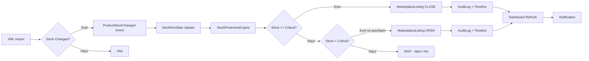

# DG STOK V5.0 — Sprint 4: Stock Protection Engine (Production)

## Mevcut Durum Analizi

### Var Olan Sistem
- `services/stockProtection/StockProtectionEngine.ts` (1061 satır) — V3 motoru
- `services/stockProtection/MarketplaceAdapter.ts` — Adapter arayüzü
- `services/stockProtection/AdapterRegistry.ts` — Adapter kaydı
- `services/stockMonitor.ts` (445 satır) — Eski monitör
- `routes/stockProtection.ts` (227 satır) — API route'ları
- `routes/index.ts` içinde `/stock-protection/rules`, `/stock-protection/critical`

### Eksikler
1. StockProtectionEngine WorkflowState ile entegre DEĞİL
2. `stockMonitor.ts` ayrı çalışıyor, EventBus kullanmıyor
3. Kullanıcı ayarları (per-XML-source) yok
4. Dashboard'da stock protection kartları yok
5. Timeline entegrasyonu yok
6. Aynı stok değişiminde duplicate API çağrısı koruması yok

---

## Adım Adım Uygulama

### ADIM 1: Prisma Schema — StockProtectionRule Modeli

```prisma
model StockProtectionRule {
  id              String   @id @default(uuid())
  xmlSourceId     String?  // XML kaynağına özel (null = global)
  xmlSource       XmlSource? @relation(fields: [xmlSourceId], references: [id])
  marketplaceKey  String?  // null = tüm pazaryerleri
  criticalStock   Int      @default(3)
  autoCloseEnabled Boolean @default(true)
  autoOpenEnabled  Boolean @default(true)
  waitMs          Int      @default(30000)
  isActive        Boolean  @default(true)
  createdAt       DateTime @default(now())
  updatedAt       DateTime @updatedAt
}
```

### ADIM 2: StockProtectionEngine → WorkflowState Entegrasyonu

StockProtectionEngine'e ekle:
- `checkProductStock()` sonrası `WorkflowStateManager.recordTimeline()` çağır
- `WorkflowStateManager.updateStockStatus()` ile WorkflowState güncelle
- Başarısız API çağrılarında AuditLog kaydı

### ADIM 3: EventBus — ProductStockChanged Handler

EventListeners'a ekle:
```typescript
EventBus.on('ProductStockChanged', async (event) => {
  // WorkflowState güncelle: LOW_STOCK / OUT_OF_STOCK / RESTOCKED
  // StockProtectionEngine.checkProductStock() çağır
  // Timeline kaydı ekle
  // DashboardRefresh tetikle
});
```

### ADIM 4: StockMonitor → Legacy

`stockMonitor.ts` eski sistemi kullanıyor. Yeni sistem EventBus + StockProtectionEngine kullanıyor.
- `stockMonitor.ts` → `legacy/services/stockMonitor.ts`

### ADIM 5: Dashboard Stock Kartları

SummaryService'e ekle:
- `criticalStockProducts: number` — Stok kritik olan ürün sayısı
- `autoClosedToday: number` — Bugün otomatik kapananlar
- `autoOpenedToday: number` — Bugün otomatik açılanlar
- `apiErrors: number` — API hata sayısı

### ADIM 6: Kullanıcı Ayarları API

`routes/stockProtection.ts`'e ekle:
- `GET /stock-protection/rules` — Kuralları listele
- `POST /stock-protection/rules` — Kural ekle
- `PUT /stock-protection/rules/:id` — Kural güncelle
- `DELETE /stock-protection/rules/:id` — Kural sil

---

## Event Flow (Hedef)



---

## Değişecek Dosyalar

| Dosya | Değişiklik |
|-------|-----------|
| `prisma/schema.prisma` | + StockProtectionRule modeli |
| `services/stockProtection/StockProtectionEngine.ts` | WorkflowState + Timeline entegrasyonu |
| `services/workflow/EventListeners.ts` | + ProductStockChanged handler |
| `services/workflow/WorkflowStateManager.ts` | + updateStockStatus() |
| `services/stockMonitor.ts` | → legacy/ |
| `routes/stockProtection.ts` | + Kullanıcı ayarları CRUD |
| `services/autoRecalculation/SummaryService.ts` | + Stock KPI'ları |
| `routes/index.ts` | Stock protection route güncelle |

---

## Kabul Kriterleri

| Kriter | Durum |
|--------|-------|
| WorkflowState ile tam entegre | ⬜ |
| EventBus üzerinden çalışıyor | ⬜ |
| Manuel buton gerekmiyor | ⬜ |
| Duplicate API çağrısı engelleniyor | ⬜ |
| API hataları loglanıyor | ⬜ |
| Derleme hatası yok | ⬜ |
