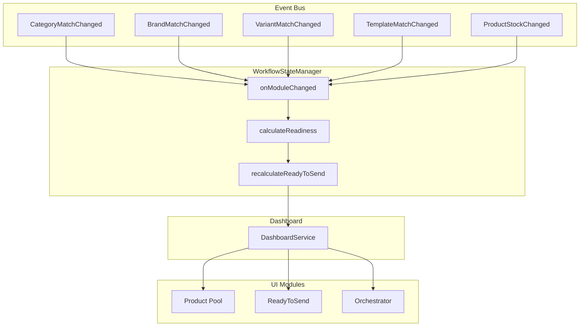

# DG STOK V5.0 — Sprint 2: WorkflowState Production Refactor

## Mevcut Durum Analizi

### Mevcut Sistemdeki Sorunlar

1. **İki farklı Workflow sistemi var:**
   - `routes/workflow.ts` (eski) + `services/workflowEngine.ts` (eski, 400+ satır)
   - `routes/workflowState.ts` (V2) + `services/workflow/WorkflowStateManager.ts` (V2, 426 satır)
   - `routes/workflow-v2.ts` (ayrı route, 50 satır)

2. **İki farklı EventBus var:**
   - `services/eventBus/EventBus.ts` (statik, EventListeners kullanır)
   - `services/operation/EventBus.ts` (singleton, operation servisleri kullanır)

3. **Product tablosunda state alanları var:**
   - `categoryMatch`, `brandMatch`, `variantMatch`, `templateMatch`
   - `status` alanı (`XML`, `READY`, `ERROR`)
   - Bu alanlar WorkflowState'de de var → **çifte doğruluk kaynağı**

4. **Dashboard birden çok tablo okuyor:**
   - `workflowState`, `product`, `marketplaceState` vs.

---

## Yeni State Chain

```mermaid
flowchart LR
    XI[XML_IMPORTED] --> CM[CATEGORY_MATCHED]
    CM --> BM[BRAND_MATCHED]
    BM --> VM[VARIANT_MATCHED]
    VM --> LM[LISTING_MATCHED]
    LM --> RTS[READY_TO_SEND]
    RTS --> S[SENT]
    S --> A[ACTIVE]
    A --> LS[LOW_STOCK]
    LS --> OS[OUT_OF_STOCK]
    OS --> MC[MARKETPLACE_CLOSED]
    MC --> RS[RESTOCKED]
    RS --> MO[MARKETPLACE_OPENED]
    
    CM -.->|Kategori reset| XI
    BM -.->|Marka reset| CM
    VM -.->|Varyant reset| BM
    LM -.->|Şablon reset| VM
```



### State Açıklamaları

| State | Açıklama | Kriter |
|-------|----------|--------|
| `XML_IMPORTED` | XML'den geldi, hiçbir işlem yapılmadı | Varsayılan |
| `CATEGORY_MATCHED` | Kategori eşleştirildi | `stepCategory=OK` |
| `BRAND_MATCHED` | Marka eşleştirildi | `stepBrand=OK` |
| `VARIANT_MATCHED` | Varyant eşleştirildi | `stepVariant=OK` |
| `LISTING_MATCHED` | Listeleme şablonu atandı | `stepTitle=OK` |
| `READY_TO_SEND` | Gönderime hazır | Tüm üst adımlar OK |
| `SENT` | Pazaryerine gönderildi | Marketplace'te SENT |
| `ACTIVE` | Pazaryerinde aktif | Satışta |
| `LOW_STOCK` | Stok kritik seviyede | Stok ≤ minStock |
| `OUT_OF_STOCK` | Stok tükendi | Stok = 0 |
| `MARKETPLACE_CLOSED` | Pazaryeri listelemesi kapalı | Otomatik/manuel kapama |
| `RESTOCKED` | Stok geri geldi | Stok > minStock |
| `MARKETPLACE_OPENED` | Yeniden yayına alındı | Tekrar açıldı |

---

## Adım Adım Uygulama Planı

### AŞAMA 1: Prisma Şema Güncelleme

#### WorkflowState Modeli Değişikliği

```prisma
model WorkflowState {
  id          String   @id @default(uuid())
  productId   String   @unique
  status      String   @default("XML_IMPORTED")  // Yeni chain
  stepCategory String? // OK | MISSING
  stepBrand   String?
  stepVariant String?
  stepTemplate String?
  readiness   Int      @default(0)  // 0-100
  errorCount  Int      @default(0)
  lastError   String?
  createdAt   DateTime @default(now())
  updatedAt   DateTime @updatedAt
}
```

**Değişiklikler:**
- `status` default: `"XML_IMPORTED"` (yeni chain)
- `stepTitle` → `stepTemplate` (daha açıklayıcı)
- `stepSeo`, `stepPrice`, `stepImage`, `stepBarcode`, `stepStock` kaldırıldı (gereksiz)
- `aiSuggested` kaldırıldı

#### Product Modeli Temizlik

```prisma
model Product {
  // Silinecek alanlar:
  // categoryMatch  Boolean  @default(false)  → WorkflowState'de
  // variantMatch   Boolean  @default(false)  → WorkflowState'de
  // brandMatch     Boolean  @default(false)  → WorkflowState'de
  // templateMatch  Boolean  @default(false)  → WorkflowState'de
  // status         String   @default("XML")  → WorkflowState'de
}
```

### AŞAMA 2: WorkflowStateManager Yeniden Yazma

**Mevcut:** 426 satır, karmaşık cascade mantığı
**Yeni:** State machine + cascade + READY_TO_SEND hesaplama

```typescript
// New WorkflowStateManager
class WorkflowStateManager {
  // State chain definition
  static STATE_CHAIN = [
    'XML_IMPORTED',
    'CATEGORY_MATCHED',
    'BRAND_MATCHED',
    'VARIANT_MATCHED',
    'LISTING_MATCHED',
    'READY_TO_SEND',
    'SENT',
    'ACTIVE',
    'LOW_STOCK',
    'OUT_OF_STOCK',
    'MARKETPLACE_CLOSED',
    'RESTOCKED',
    'MARKETPLACE_OPENED',
  ];

  // Cascade rules
  static CASCADE_RULES = {
    CATEGORY: ['BRAND', 'VARIANT', 'TEMPLATE', 'READY_TO_SEND'],
    BRAND: ['VARIANT', 'TEMPLATE', 'READY_TO_SEND'],
    VARIANT: ['TEMPLATE', 'READY_TO_SEND'],
    TEMPLATE: ['READY_TO_SEND'],
  };

  // onModuleChanged - Cascade + WorkflowState update
  // calculateReadiness - Readiness score
  // calculateStatus - Determine current status from steps
  // recalculateReadyToSend - RTS check
}
```

### AŞAMA 3: EventBus Tekilleştirme

**Mevcut:** 2 EventBus
**Yeni:** `services/eventBus/EventBus.ts` (statik) → TEK EventBus

- `services/operation/EventBus.ts` → legacy'e taşı
- Tüm import'ları `services/eventBus/EventBus.ts`'e yönlendir

### AŞAMA 4: EventListeners Güncelleme

Her event şu zinciri tetikleyecek:

```
Event → WorkflowStateManager.onModuleChanged() → Cascade → AutoRecalculation → DashboardRefresh
```

Event'ler:
- `CategoryMatchChanged` → cascade: BRAND, VARIANT, TEMPLATE, READY_TO_SEND
- `BrandMatchChanged` → cascade: VARIANT, TEMPLATE, READY_TO_SEND
- `VariantMatchChanged` → cascade: TEMPLATE, READY_TO_SEND
- `TemplateMatchChanged` → cascade: READY_TO_SEND
- `ProductStockChanged` → cascade: LOW_STOCK/OUT_OF_STOCK/RESTOCKED

### AŞAMA 5: Route Güncelleme

| Eski Route | Yeni Route | Durum |
|-----------|-----------|-------|
| `routes/workflow-v2.ts` | `legacy/routes/` | ❌ Taşınacak |
| `routes/workflow.ts` | `legacy/routes/` | ❌ Taşınacak (yerine workflowState.ts var) |
| `routes/workflowState.ts` | Güncellenecek | ✅ Kalacak + iyileştirilecek |

### AŞAMA 6: Dashboard Güncelleme

Dashboard route'u:
- `GET /dashboard/stats` → Yalnızca `WorkflowState` okuyacak
- Artık `Product.categoryMatch`, `Product.brandMatch` vb. okumayacak

### AŞAMA 7: Readiness Hesaplama

```typescript
function calculateReadiness(ws: WorkflowState): number {
  // 0-100 arası puan
  const steps = [
    ws.stepCategory === 'OK' ? 25 : 0,     // Kategori: 25 puan
    ws.stepBrand === 'OK' ? 25 : 0,         // Marka: 25 puan
    ws.stepVariant === 'OK' ? 25 : 0,       // Varyant: 25 puan
    ws.stepTemplate === 'OK' ? 25 : 0,      // Şablon: 25 puan
  ];
  return steps.reduce((a, b) => a + b, 0);
}
```

### AŞAMA 8: READY_TO_SEND Hesaplama

```typescript
function isReadyToSend(ws: WorkflowState): boolean {
  return ws.stepCategory === 'OK' 
    && ws.stepBrand === 'OK'
    && ws.stepVariant === 'OK'
    && ws.stepTemplate === 'OK';
}
```

### AŞAMA 9: Legacy'e Taşınacak Dosyalar

| Dosya | Yeni Konum |
|-------|-----------|
| `services/workflowEngine.ts` | `legacy/services/workflowEngine.ts` |
| `services/operation/EventBus.ts` | `legacy/services/operation/EventBus.ts` |
| `services/operation/types.ts` | `legacy/services/operation/types.ts` |
| `services/operation/index.ts` | `legacy/services/operation/index.ts` |
| `services/operation/OperationEngine.ts` | `legacy/services/operation/OperationEngine.ts` |
| `services/operation/OperationQueue.ts` | `legacy/services/operation/OperationQueue.ts` |
| `services/operation/OperationStore.ts` | `legacy/services/operation/OperationStore.ts` |
| `services/operation/RetryManager.ts` | `legacy/services/operation/RetryManager.ts` |
| `routes/workflow-v2.ts` | `legacy/routes/workflow-v2.ts` |

---

## Sistem Mimarisi (Hedef)



---

## API Uyumluluk Tablosu

| Endpoint | Değişiklik | Durum |
|----------|-----------|-------|
| `GET /workflow/stats` | Legacy route → 404 döner, `/workflow-state/stats` kullan | ⚠️ |
| `GET /workflow/products` | Legacy route → 404 döner, `/workflow-state/products` kullan | ⚠️ |
| `GET /workflow-state/stats` | ✅ Kalır, WorkflowStateManager.getStats() kullanır | ✅ |
| `GET /workflow-state/products` | ✅ Kalır, WorkflowState üzerinden sorgular | ✅ |
| `GET /dashboard/stats` | Güncellenir: Product alanları yerine WorkflowState okur | 🔄 |
| `GET /products` | Değişmez, Product CRUD kalır | ✅ |
| `GET /variants/*` | Değişmez (V5 kullanıyor) | ✅ |

---

## Risk Değerlendirmesi

| Risk | Olasılık | Etki | Önlem |
|------|---------|------|-------|
| Product alanları silinirse frontend kırılabilir | Yüksek | Kritik | Frontend'de `product.categoryMatch` kullanımını kontrol et |
| EventBus değişirse diğer servisler kırılabilir | Orta | Yüksek | operation/EventBus kullanan tüm dosyaları tara |
| WorkflowState cascade'i yanlış hesaplanırsa RTS bozulur | Düşük | Kritik | Test ile doğrula |
| İki EventBus birleşirse event kaybı olabilir | Düşük | Yüksek | Tüm event aboneliklerini kontrol et |
| Dashboard hatalı veri gösterebilir | Orta | Yüksek | Dashboard testlerini çalıştır |
